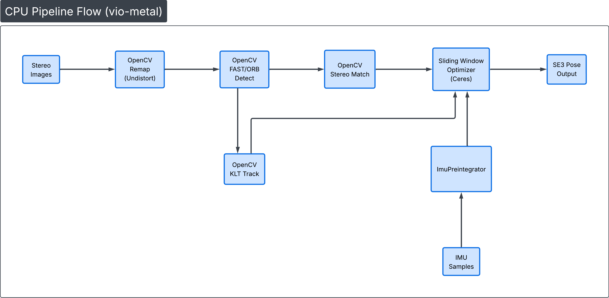
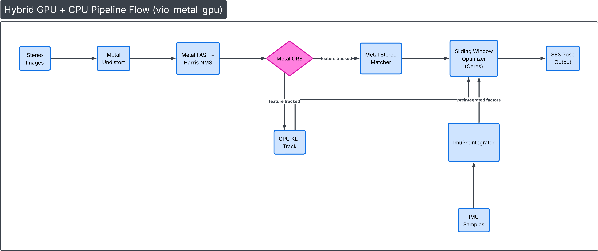

# vio-metal

Real-time stereo visual-inertial odometry on Apple Silicon with Metal GPU acceleration.

## Overview

**vio-metal** fuses stereo camera frames and IMU measurements to produce 6-DoF pose estimates in real time, targeting sub-30ms per-frame latency on Apple Silicon. The system exploits the unified memory architecture (UMA) for zero-copy CPU↔GPU data sharing.

The project now features two parallel front-end tracking pipelines: a **CPU fallback version** using OpenCV, and a **hybrid GPU+CPU version** using custom Metal compute shaders for feature detection and stereo matching, with KLT tracking on CPU. Both versions feed into a sliding window optimization backend powered by Ceres Solver.

### Implemented Metal GPU Kernels

The GPU pipeline offloads key vision front-end components to Apple Silicon via custom `.metal` compute shaders:

- **Metal Undistort:** GPU-accelerated stereo image rectification.
- **Metal FastDetect:** FAST corner detection.
- **Metal HarrisResponse:** Sub-pixel corner scoring and non-maximum suppression (Grid NMS).
- **Metal ORBDescriptor:** 256-bit rotated BRIEF descriptor extraction.
- **Metal StereoMatcher:** Epipolar stereo matching using Hamming distance.
- **CPU KLTTracker:** Pyramidal Lucas-Kanade optical flow tracking (moved to CPU for this branch).

## Requirements

- **macOS** ≥ 14.0 (Sonoma)
- **Xcode** ≥ 15.0
- **CMake** ≥ 3.25

### Dependencies

```bash
brew install cmake eigen ceres-solver opencv yaml-cpp
pip install evo  # for trajectory evaluation
```

**Note:** The real-time 3D trajectory visualizer requires Pangolin, which must be built from source.

## Build

```bash
mkdir build && cd build
cmake .. -DCMAKE_BUILD_TYPE=Release
cmake --build . -j$(sysctl -n hw.ncpu)
```

## Dataset

Download the EuRoC MAV Dataset:

```bash
./scripts/download_euroc.sh ./data/euroc
```

## Run

Both pipelines support the following flags:

| Flag | Description |
|------|-------------|
| `--headless` | Run without the Pangolin visualizer window |
| `--quiet` | Suppress per-frame terminal logging |

By default, both the visualizer and terminal logging are active.

### GPU Pipeline (Metal + CPU KLT)

```bash
# With visualizer + terminal logging
./build/vio-metal-gpu <dataset_path> ./build/shaders.metallib

# Headless (no window) + terminal logging
./build/vio-metal-gpu <dataset_path> ./build/shaders.metallib --headless

# Headless + quiet (logging to files only)
./build/vio-metal-gpu <dataset_path> ./build/shaders.metallib --headless --quiet
```

### CPU Pipeline (OpenCV)

```bash
# With visualizer + terminal logging
./build/vio-metal <dataset_path>

# Headless + terminal logging
./build/vio-metal <dataset_path> --headless
```

### Terminal Output

When not `--quiet`, each keyframe prints a status line:

```
[  42] cost: 3634.8 -> 0.0  iter: 5  lm: 34  res: 113  CONV  pos: (0.88, 2.14, 0.95)  err: 0.003m
```

Fields: frame index, initial/final cost, solver iterations, landmark count, residual count, convergence status, estimated position, position error vs ground truth.

### Evaluation

Run the full pipeline + ATE/RPE evaluation with [evo](https://github.com/MichaelGrupp/evo):

```bash
# GPU pipeline (default)
bash eval/evaluate.sh

# CPU pipeline
bash eval/evaluate.sh cpu
```

This runs the pipeline in headless mode, converts ground truth to TUM format, computes ATE/RPE metrics, and generates cost plots.

### Output

- `results/trajectories/estimated_<timestamp>.txt` — TUM-format trajectory
- `results/configs/cost_log_<timestamp>.csv` — per-keyframe optimizer cost log
- `results/configs/cost_plot_<timestamp>.png` — cost evolution plot
- `results/configs/timing_<timestamp>.csv` — per-frame timing breakdown
- `results/configs/ate_<timestamp>.zip` — ATE results (evo)
- `results/configs/rpe_<timestamp>.zip` — RPE results (evo)

All output files are timestamped to prevent overwriting between runs.

## Architecture & Data Flow

### 1. CPU Pipeline Flow (vio-metal)



### 2. Hybrid GPU + CPU Pipeline Flow (vio-metal-gpu)



**Note:** In this branch (klttrackercpu), KLT tracking has been moved back to CPU for performance evaluation and comparison with the full GPU pipeline.


## Performance Benchmarks

The following results were generated on an Apple M-series processor using the EuRoC V1_01_easy dataset (2912 frames).

### Side-by-Side Profiling Summary

| Stage | CPU Only Avg (ms) | Hybrid GPU Avg (ms) | Notes |
|-------|-------------------|-------------------|-------|
| Undistort | 0.27 | 1.06 | GPU includes getBytes sync overhead |
| Detect | 0.31 | 0.18 | GPU Win: FAST + Harris scoring |
| Stereo Match | 0.01 | 0.45 | Hybrid uses ORB descriptor extraction |
| Track | 0.92 | 2.02 | CPU KLT tracking |
| Optimize | 2.52 | 1.35 | GPU Win: Higher quality features |
| Total AVG | 8.99 ms | 9.59 ms | |
| Total MAX | 77.54 ms | 42.78 ms | GPU Win: Drastic reduction in jitter |

### Summary Comparison

**Latency Consistency:** The Hybrid GPU version is significantly more stable. While the CPU version is slightly faster on average, it suffers from massive latency spikes (up to 77ms). The GPU version caps worst-case latency at 42ms, ensuring a much smoother real-time experience.

**Optimization Quality:** The GPU pipeline (Metal FAST + Harris Response) produces higher-quality feature localizations. This is evidenced by the Optimize stage dropping from 2.52ms to 1.35ms, as the backend solver converges much faster with the GPU-sourced data.

**Resource Balancing:** By offloading Undistort and Detection to Metal, the CPU is freed up from feature extraction tasks. 
## Project Structure

```
src/
├── core/           Types, Profiler, KeyframePolicy
├── dataset/        EurocLoader, TrajectoryWriter
├── metal/          MetalContext, MetalUndistort, shaders/ (FAST, ORB, etc.)
├── vision/         FeatureDetector, StereoMatcher, TemporalTracker, FeatureManager
├── imu/            ImuPreintegrator, ImuTypes
├── optimization/   VioOptimizer, Factors (Ceres), Marginalization
├── visualizer.h    Pangolin real-time 3D trajectory plotting
├── main.mm         CPU Pipeline orchestration
└── metal_main.mm   GPU Pipeline orchestration (with CPU KLT tracking)
```

## References

- Forster et al. "On-Manifold Preintegration for Real-Time Visual-Inertial Odometry" (TRO 2017)
- Leutenegger et al. "Keyframe-Based Visual-Inertial Odometry Using Nonlinear Optimization" (IJRR 2015)
- Qin et al. "VINS-Mono: A Robust and Versatile Monocular Visual-Inertial State Estimator" (TRO 2018)
- Burri et al. "The EuRoC Micro Aerial Vehicle Datasets" (IJRR 2016)