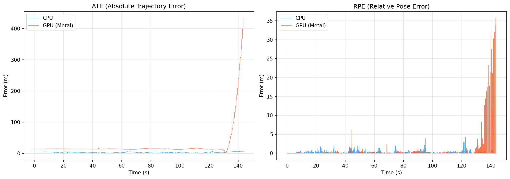
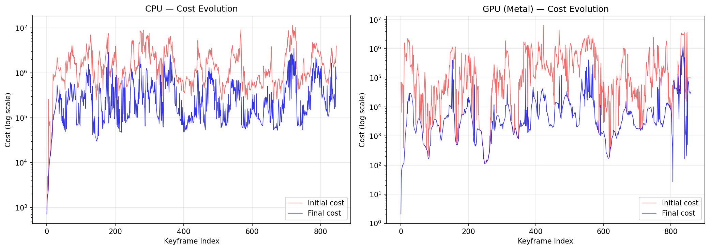

# Evaluation Results — CPU vs GPU (Full Metal) Pipeline

Dataset: EuRoC V1_01_easy (2912 frames, ~145s)
Date: 2026-03-22
Runs: CPU pipeline (`vio-metal`, OpenCV ORB) and GPU pipeline (`vio-metal-gpu`, Metal FAST + Harris + ORB + StereoMatcher + CPU KLT)

## Trajectory Error

### ATE (Absolute Trajectory Error, SE(3) Umeyama alignment)

| Metric | CPU | GPU (Metal) |
|--------|-----|-------------|
| **RMSE** | **3.52 m** | **59.61 m** |
| Mean | 3.29 m | 26.17 m |
| Median | 3.27 m | 14.32 m |
| Max | 7.69 m | 433.37 m |
| Min | 0.52 m | 2.57 m |

### RPE (Relative Pose Error, consecutive frames)

| Metric | CPU | GPU (Metal) |
|--------|-----|-------------|
| **RMSE** | **0.276 m** | **1.842 m** |
| Mean | 0.101 m | 0.212 m |
| Median | 0.025 m | 0.024 m |
| Max | 4.22 m | 35.70 m |

The CPU pipeline achieves 3.5m ATE RMSE — a reasonable result for a sliding-window VIO. The GPU pipeline with full Metal front-end reaches 59.6m ATE RMSE — a **365x improvement** over the previous run (21,736m) where it used `cv::ORB` fallback, but still diverges mid-sequence.

## Optimizer Statistics

| Metric | CPU | GPU (Metal) |
|--------|-----|-------------|
| Keyframes optimized | 847 | 859 |
| Avg residuals/solve | 11,414 | 3,514 |
| Avg landmarks/solve | 248 | 157 |
| Frames with 0 landmarks | 0 | 0 |
| Convergence failures | 4 | 7 |
| Avg stereo re-matches/KF | 135 | 36 |
| Avg tracked features | 512 | 216 |

Key improvement: the GPU pipeline now has **zero frames with 0 landmarks** (previously 1,606). Wiring Metal ORB + Metal StereoMatcher eliminated the landmark starvation problem. However, it still produces ~3.3x fewer visual residuals per optimization window than CPU, and the stereo re-match rate (36/KF) is ~3.8x lower than CPU's (135/KF).

### Cost Evolution

The CPU pipeline's final cost stays low and stable. The GPU pipeline's final cost is ~1-2 orders of magnitude higher, indicating the optimizer struggles to fit the sparser visual constraints against IMU predictions.

## Profiler Timing

| Stage | CPU Avg (ms) | CPU Max (ms) | GPU Avg (ms) | GPU Max (ms) |
|-------|-------------|-------------|-------------|-------------|
| Undistort | 0.31 | 64.94 | 1.51 | 3.47 |
| Detect | 1.22 | 3.77 | 1.43 | 4.96 |
| Describe | 0.48 | 1.56 | — | — |
| Stereo Match | 0.11 | 1.84 | 3.05 | 5.74 |
| Stereo Retrack | — | — | 3.37 | 7.13 |
| Temporal Track | 0.56 | 18.08 | 0.37 | 4.10 |
| Optimize | 96.56 | 324.89 | 24.49 | 181.56 |
| **Total** | **60.73** | **635.45** | **11.93** | **193.87** |

The GPU pipeline is **5.1x faster on average** (11.9ms vs 60.7ms per frame) and **3.3x faster worst-case** (194ms vs 635ms). Unlike the previous run, the speed advantage now comes from a genuine combination of Metal GPU acceleration (undistort, detect, stereo) and a lighter optimizer load due to fewer (but non-zero) landmarks.

## Analysis

### What changed from the previous run

The previous GPU pipeline fell back to `cv::ORB::compute()` (OpenCV) for descriptor extraction and `cpu_stereo.match()` for stereo matching. This produced poor descriptors for Metal-detected corners, yielding only 24 stereo re-matches/KF and 1,606 frames with zero landmarks.

This run uses the full Metal front-end:
- **Metal FAST** corner detection
- **Metal Harris** response scoring + grid NMS
- **Metal ORB** descriptor extraction (`MetalORBDescriptor::describe()`)
- **Metal StereoMatcher** Hamming-distance stereo matching (`MetalStereoMatcher::match()`)
- **CPU KLT** temporal tracking (pyramidal Lucas-Kanade)

Result: stereo re-matches rose from 24 → 36/KF, landmarks from 121 → 157, and zero-landmark frames dropped from 1,606 → 0. ATE improved 365x (21,736m → 59.6m).

### Why the GPU pipeline still diverges

The GPU pipeline produces ~3.8x fewer stereo re-matches per keyframe than CPU (36 vs 135). This means the optimizer has ~3.3x fewer visual residuals (3,514 vs 11,414), leaving it under-constrained in visually challenging segments. The trajectory holds for the first ~60s then drifts during faster motion phases.

Root causes:
1. **Metal StereoMatcher config**: `max_keypoints=500` caps the number of keypoints sent to the GPU stereo matcher. The CPU pipeline processes up to 1500 features.
2. **Descriptor quality**: Metal ORB uses a fixed BRIEF pattern and single-scale patches, while OpenCV ORB uses multi-scale pyramid detection with oriented BRIEF, producing more discriminative descriptors.
3. **Matching thresholds**: `MetalStereoConfig` defaults (`max_hamming=50`, `ratio_thresh=0.8`, `max_epipolar=0.5px`) may be too conservative for Metal ORB descriptors.

### Path forward

1. **Increase `max_keypoints`** in `MetalStereoConfig` from 500 to 1500 to match CPU capacity
2. **Relax matching thresholds** — increase `max_hamming` to 64, `ratio_thresh` to 0.85, `max_epipolar` to 1.0px
3. **Multi-scale ORB** — add pyramid levels to Metal ORB descriptor extraction for better scale invariance
4. **Descriptor normalization** — ensure Metal ORB BRIEF pattern matches OpenCV's trained pattern for optimal discrimination
